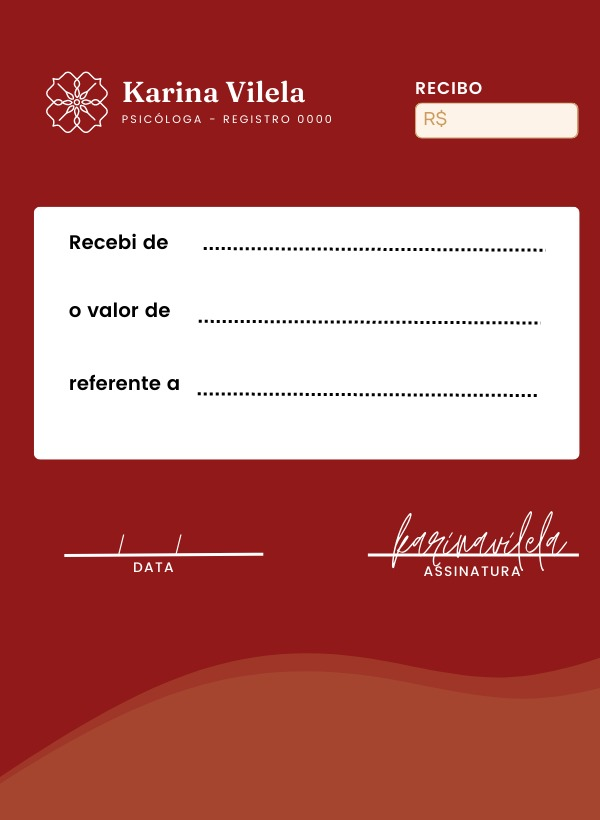

<h1 align="center">
  Gerador de Recibos
</h1>

<h2 align="center">
  Utiliza a biblioteca FPDF em Python que habilitará a escrever em arquivos PDF e meu objetivo vai ser gerar um recibo em PDF.
</h2>

Uma profissional (Karina Vilela, de nome fictício) precisa automatizar a geração de recibos via PDF e para isso, entrou em contato comigo para ajudá-la.

Ela possui um template que já utiliza em seus recibos manuais e agora precisa de um programa em Python que poderá automatizar essa geração do recibo.

